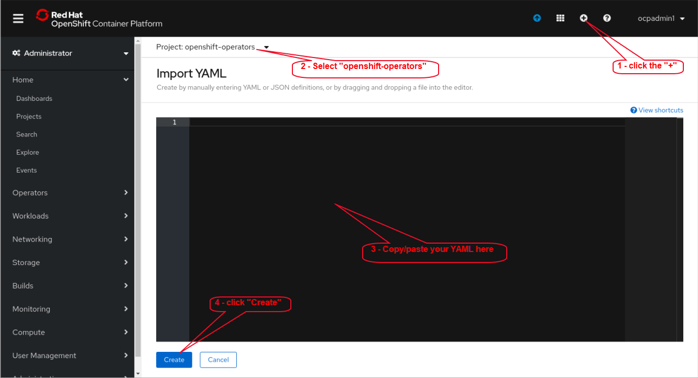

# openliberty-operator-ocpz
Using the Open Liberty Operator in Openshift on IBM Z

# Overview

The [Open Liberty Operator](https://github.com/OpenLiberty/open-liberty-operator) can be used to deploy and manage applications running [Open Liberty](https://github.com/OpenLiberty) into [Openshift](https://www.openshift.com/) clusters. You can also perform Day-2 operations such as gathering traces and dumps using the operator.

In the case of Openshift on IBM Z, the Operator Hub does not yet support multi-arch images.  So, we must install the Open Liberty Operator directly, using the Operator's YAML files via either; a) oc command line, or b) the Openshift console.
This is a point-in-time thing.  Multi-arch image support is coming soon.  When multi-arch image support becomes available, the Operator can then be installed via the Openshift console's Operator Hub Web UI.  The procedures outlined here will still work either way.

At a high level, the process shown here will demonstrate;
- Installation of the Open Liberty Operator into an existing Openshift cluster running on IBM Z.
- Building a container image containing a Open Liberty server with a simple demo web application (mod resorts).
- Pushing the resulting container image to an Openshift internal image registry.
- Deploying the application into an Openshift cluster, using an OpenLibertyApplication CR, thereby leveraging the Open Liberty Operator.

The demo application used (mod resorts) is admitedly a simple use-case, with no dependencies on external resources.  There will likely be dependencies on external resources in real-world applications.  There are many options for integrating applicaitions with those external resources (eg. ConfigMaps, Volume mounts, secrets, etc).  These are beyond the scope of this topic.

A word about building container images.
In the example below, we will be using a pre-existing container image containing Open Liberty from a public image registry (Docker Hub in this case) as a basis upon which to build.  Customers quite often don't permit container images from public Docker Hub to be used inside their enterprise.  Thus, the question about what to use and/or how to build a custom image often arises.  There are many options available.  See the [WebSphere Liberty Knowledge Center](https://www.ibm.com/support/knowledgecenter/en/SSAW57_liberty/com.ibm.websphere.wlp.nd.multiplatform.doc/ae/twlp_container_cont.html)

## Pre-requisites

- An Openshift 4.2 or 4.3 cluster running on IBM Z or LinuxONE
  - A userid with cluster-amin privileges
  - The cluster's image registry is configured with persistent storage
  - The cluster's image registry is exposed via the default route
- A client system with the oc cli and either; a) Docker, or b) podman & buildah

## Resources

- [Open Liberty Operator](https://www.github.com/OpenLiberty/open-liberty-operator)
  - [Open Liberty Operator Users Guide](https://github.com/OpenLiberty/open-liberty-operator/blob/master/doc/user-guide.adoc)
- [Openshift 4.2 Documentation](https://docs.openshift.com/container-platform/4.2/welcome/index.html)
  - [Configuring registry storage](https://docs.openshift.com/container-platform/4.2/registry/configuring_registry_storage/configuring-registry-storage-baremetal.html)
  - [Exposing the registry](https://docs.openshift.com/container-platform/4.2/registry/securing-exposing-registry.html)
- [Openshift 4.3 Documentation](https://docs.openshift.com/container-platform/4.3/welcome/index.html)
  - [Configuring registry storage](https://docs.openshift.com/container-platform/4.3/registry/configuring_registry_storage/configuring-registry-storage-baremetal.html)
  - [Exposing the registry](https://docs.openshift.com/container-platform/4.3/registry/securing-exposing-registry.html)

# Install the Operator

As previously noted, at the moment, installation of the Open Liberty Operator can not be performed via the Openshift console's Operator Hub web UI.
You can, however, quite easily install the Open Liberty Operator directly via;
  - The Openshift console's web UI facilities for adding YAML resources.
  - `oc` command line.

To install the Operator into an Openshift cluster, you can find the .yaml files (there are three of them) for one of the Open Liberty Operator [releases](https://github.com/OpenLiberty/open-liberty-operator/tree/master/deploy/releases).

<details>
<summary>Install by copy/paste YAML in the Console web UI</summary>

To install the Operator's YAML files via the Openshift console's web UI.  
Upon logging into the Openshift console, click on the "+" sign in the upper-right corner.  Then, select `openshift-operators` in the project drop-down, copy/paste the YAML, and click Create.



</details>

In order to minimize typing tedium and mitigate the risk of typing errors, a simple set of shell scripts has also been supplied in the [ol-operator-install](ol-operator-install) folder.  You can use the shell scripts by transfering them to a system containing the Openshift `oc` cli.  Before running the shell scripts, **be sure to edit the environment variables in the `env` file**, to reflect your system-specfic settings.
The shell scripts in the ol-operator-install folder;
Name                            | Description
--------------------------------|--------------------------
1-install-ol-operator.sh        | A simple shell script to install the Open Liberty Operator using `oc` command line commands.
2-uninstall-ol-operator.sh      | A simple shell script to uninstall the Open Liberty Operator using `oc` coomand line commands.
env                             | Envrironment variables (sourced by the shell scripts)

# Use the operator to install an application

Before we can run an Open Liberty application, we need to package Open Liberty with an application and it's configuration.
There are many ways to accomplish this.  Quite often this will be automated in a CI/CD pipeline.  
Here we will do it manaually to show the steps involved.  We will be using a simple web application (mod resorts).
Please refer to the contents of the [ol-app-install](ol-app-install) folder.  

As a convenience, there are a number of shell scripts provided which automate the manual steps described in the sections below. 
You can use the shell scripts by transfering them to a system containing the Openshift `oc` command line tool, and container runtime tools (either Docker or buildah & podman).  Before running the shell scripts, **be sure to edit the environment variables in the `env` file**, to reflect your system-specfic settings.

The shell scripts in the ol-app-install folder;
Name              | Description
------------------|--------------------------
1-build.sh        | Log into Openshift cluster, create a project, build a container image, and push the image to the Openshift internal registry.
2-deploy.sh       | Log into Openshift cluster, create an instance of an `OpenLibertyApplication` CR, thereby engaging the Open Liberty Operator to deploy the application.
3-cleanup.sh      | Cleans up the application deployment, delete the Openshift project.
env               | Envrironment variables (sourced by the shell scripts)


## Build and push the container image  
Log onto a system where the Openshift `oc` cli tool, and either; a) Docker or b) podman & buildah are installed.  
Copy the following files from the `ol-app-install` folder onto the system;
- Dockerfile
- app-mod-withroute_cr.yaml
- modresorts-1.0.war
- server.xml

**Note**: In the commands that follow, substitute parameters denoted by `<xxxx>` with values specific to your environment

1. Log into the Openshift cluster  
  ```oc login <OPENSHIFT_API_URL>:<PORT> --username <userid> --password <password> --insecure-skip-tls-verify=true```  

1. Create an Openshift project  
  ```oc new-project <OPENSHIFT_PROJECT>```  

1. Log into the Openshift internal image registry  
  If the client system has Docker  
    ```docker login --username <userid> --password $(oc whoami -t) <OPENSHIFT_REGISTRY_URL>```  
  If the client system has podman & buildah  
    ```podman login --username <userid> --password $(oc whoami -t) --tls-verify=false <OPENSHIFT_REGISTRY_URL>```  

1. Build the container image  
  If the client system has Docker  
    ```docker build -t <OPENSHIFT_REGISTRY_URL>/<OPENSHIFT_PROJECT>/app-modernization:v1.0.0 .```  
  If the client system has podman & buildah  
    ```buildah build-using-dockerfile -t <OPENSHIFT_REGISTRY_URL>/<OPENSHIFT_PROJECT>/app-modernization:v1.0.0 .```  
    
1. Push the image  
  If the client system has Docker  
    ```docker push <OPENSHIFT_REGISTRY_URL>/<OPENSHIFT_PROJECT>/app-modernization:v1.0.0```  
  If the client system has podman & buildah  
    ```podman push --tls-verify=false <OPENSHIFT_REGISTRY_URL>/<OPENSHIFT_PROJECT>/app-modernization:v1.0.0```

## Deploy the application

Review the `app-mod-withroute_cr.yaml` file.  
Edit this file, replacing parameters denoted by `<xxxxx>` with values appropriate to your environment.

```
apiVersion: openliberty.io/v1beta1
kind: OpenLibertyApplication
metadata:
  name: appmod
spec:
  applicationImage: image-registry.openshift-image-registry.svc:5000/<OPENSHIFT_PROJECT>/app-modernization:v1.0.0
  expose: true
  route:
    host: 'modresort.apps.<SUB_DOMAIN>.<BASE_DOMAIN>'
    path: '/resorts'
```  

The creation of this single Custom Resource (CR) definition will result in the Open Liberty Operator deploying the application into the Openshift cluster.  In doing so, will result in the creation of the following cluster resources;
- Deployment
- Pod
- Service
- Route

1. Log into the Openshift cluster  
  ```oc login <OPENSHIFT_API_URL>:<PORT> --username <userid> --password <password> --insecure-skip-tls-verify=true```  

1. Create an instance of an OpenLibertyApplication CR using the customized .yaml file above.  
  ```oc -n <OPENSHIFT_PROJECT> create -f app-mod-withroute_cr.yaml```  
  
## Access the application in a browser  

1. Get the application's route & path  
  ```oc -n <OPENSHIFT_PROJECT> get routes```  
  
  The output might look something like;  
  
NAME   | HOST/PORT                        | PATH     | SERVICES | PORT     | TERMINATION | WILDCARD
-------|----------------------------------|----------|----------|----------|-------------|---------
appmod | modresort.apps.ocpv4.example.com | /resorts | appmod   | 9080-tcp |             | None

  Using the values in the HOST/PORT and PATH columns, open a web browser and access the application.  
  For example: http://modresorts.apps.ocpv4.example.com/resorts  
  
  You should expect to see a page similar to the following


